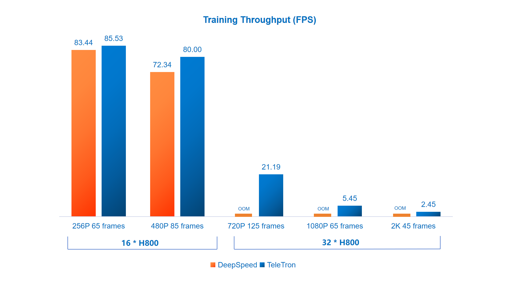
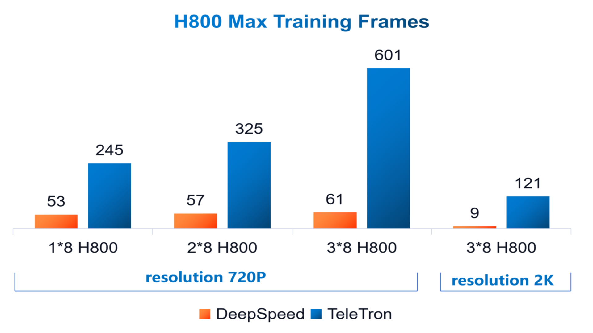

<div align="center">


TeleTron
===========================

<h4>To pioneer training long-context multi-modal transformer models</h4>

[](./setup.py)
[](./LICENSE)

<div align="left">

## ⏱️Speed Benchmark 

| HunyuanVideo Training Throughput | Max Training Frames  |
|:---:|:---:|
|  |  |


## 📖Introduction

TeleTron features flexible parallel strategy and fused cuda kernels to best facilitate **long-context**, **efficient** and **flexible** training of multi-modal transformer models.

* Long-Context
  * TeleTron leverages mixed parallel strategy, activation checkpointing and fused cuda kernels at the same time to optimize GPU memory usage, so as to train [HunyuanVideo](https://github.com/Tencent/HunyuanVideo) with more than 30s 720P video clips.
* Efficient
  * With fused cuda kernels, TeleTron facilitates faster training than general training optimization libraries like [DeepSpeed](https://github.com/deepspeedai/DeepSpeed).
* Flexible
  * Training with a variety of video sequence length and model size, TeleTron supports flexible adjustment of parallel strategy among data parallel, context parallel, and/or tensor parallel.

TeleTron has released code for HunyuanVideo I2V fine-tuning and has been supporting **[TeleAI VAST](https://arxiv.org/abs/2412.16677v1)** (Video As Storyboard from Text) on high-resolution video generation training (code to be released). 

## ⚡️QuickStart

### Installation

To save efforts on environment setup, it is recommended using [nvcr](https://catalog.ngc.nvidia.com/orgs/nvidia/containers/pytorch/tags)'s 24.10-py3 container image. 

```
# pull docker image
docker pull nvcr.io/nvidia/pytorch:24.10-py3

# start docker container
sudo docker run --gpus all -itd --shm-size 512G --name teletron  nvcr.io/nvidia/pytorch:24.10-py3 /bin/bash

# enter the container
sudo docker exec -it teletron /bin/bash
```

In the docker container, follow the script below to setup TeleTron.

```
# get TeleTron
git clone git@github.com:Tele-AI/TeleTron.git --recurse-submodule

# install requirements
pip install -r requirements.txt

# install TeleTron fused kernels 
cd teletron_op && bash install.sh && cd -
```

### Sanity Check

The script below will run a tiny version of HunyuanVideo with fake data. It serves as a sanity check for that the environment is correctly set up.

```
CUDA_VISIBLE_DEVICES=0,1,2,3,4,5,6,7 MASTER_PORT=12345 bash examples/hunyuanvideo/run_unified_sanity_check.sh 1 1
```

### Training

* single node training

```
bash examples/hunyuanvideo/run_unified.sh 2 2 9
```

Note that the numbers "2 2 9" above denotes TP size, CP size, and number of frames respectively.  The default video resolution is 720P, and you may also alter training video resolution by adding `--video-resolution {width} {height}`  to the training arguments in the shell script `run_unified.sh`. 

* Multi-node training

Run the script below respectively on 4 * 8 H800 nodes and 129-frame 720P training will be initiated. Note that for full finetuning you still need to [download](https://huggingface.co/tencent/HunyuanVideo/tree/main) and [convert](./teletron/convert_ckpt/hunyuan/convert_ckpt.md) HunyuanVideo pretrained weights.

```
bash examples/hunyuanvideo/run_unified.sh 1 4 129
```

## 🔥News

- **2025/5/16**: TeleTron first release with code for HunyuanVideo full-finetuning and inference!

## ✨Features

- [x] Ulysses Context Parallel
- [x] Tensor Parallel 
- [x] AdaLayerNorm fused kernel
- [x] RmsNorm fused kernel
- [ ] [Unified Sequence Parallel](https://arxiv.org/abs/2405.07719) 

## Acknowledgement

* [Megatron-LM](https://github.com/NVIDIA/Megatron-LM)
* [Diffusers](https://github.com/huggingface/diffusers)
* [yunchang](https://github.com/feifeibear/long-context-attention)
* [HunyuanVideo](https://github.com/Tencent/HunyuanVideo)
* [Koala-36M](https://github.com/KwaiVGI/Koala-36M)
* [Pai-Megatron-Patch](https://github.com/alibaba/Pai-Megatron-Patch)

## License

[Apache 2.0 License](./LICENSE)

