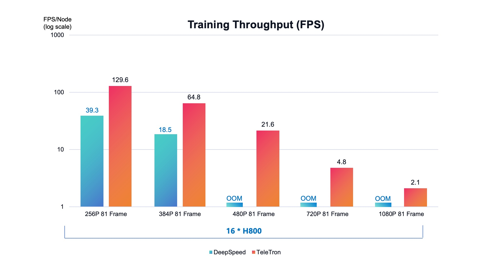

<div align="center">


TeleTron
===========================

<h4>To Pioneer Long-Context Multi-Modal Transformer Training</h4>

[](./setup.py)
[](./LICENSE)

<div align="left">

## ⏱️Speed Benchmark 





^ Experiments conducted on Wan2.1 model training using the latest version of TeleTron (2025/07/29).

## 🔥News
- **2025/07/15**: TeleTron supports Wan-2.1 i2v training!
- **2025/06/13**: TeleTron accelerates HunyuanVideo training by 30%+ by Distributed Multi-Modal Encoders!
- **2025/05/16**: TeleTron first release with code for HunyuanVideo full-parameter training and inference! [[Zhihu]](https://zhuanlan.zhihu.com/p/1907030055512671098) [[WeChat]](https://mp.weixin.qq.com/s/Ie1NulNlUmzqSCRCFAXy7Q)

## 📖Introduction

TeleTron features flexible parallel strategy and fused cuda kernels to best facilitate **long-context**, **efficient** and **flexible** training of multi-modal transformer models.

* 📜 **Long-Context Training**</br>
  TeleTron leverages mixed parallel strategy, activation checkpointing and fused cuda kernels at the same time to optimize GPU memory usage, so as to train [HunyuanVideo](https://github.com/Tencent/HunyuanVideo) with more than 30 seconds of video clips in 720P.
* 🚀 **Efficient at Scale**</br>
  Through CUDA optimization and distributed training techniques, TeleTron can achieve higher throughput than general Transformer training frameworks, especially at a large scale.
* 🛠️ **Flexible in Application**</br>
  Training with a variety of video sequence length and model size, TeleTron supports flexible adjustment of parallel strategy among data parallel, context parallel, and/or tensor parallel.

TeleTron has released code for HunyuanVideo I2V fine-tuning and has been supporting **[TeleAI VAST](https://arxiv.org/abs/2412.16677v1)** (Video As Storyboard from Text) on high-resolution video generation training (code to be released). 

## ⚡️QuickStart

### Installation

To save efforts on environment setup, it is recommended using [nvcr](https://catalog.ngc.nvidia.com/orgs/nvidia/containers/pytorch/tags)'s 24.10-py3 container image. 

```
# pull docker image
docker pull nvcr.io/nvidia/pytorch:24.10-py3

# start docker container
sudo docker run --gpus all -itd --shm-size 512G --name teletron  nvcr.io/nvidia/pytorch:24.10-py3 /bin/bash

# enter the container
sudo docker exec -it teletron /bin/bash
```

In the docker container, follow the script below to setup TeleTron.

```
# get TeleTron
git clone git@github.com:Tele-AI/TeleTron.git

# install requirements
pip install -r requirements.txt

# install TeleTron fused kernels 
cd teletron_op && bash install.sh && cd -
```

### Training

* single node training

Run the script below and Wan i2v training will be started (5 GPUs required).
```
bash examples/wan/run_wan.sh
```


## ✨Features

- [x] Ulysses Context Parallel
- [x] Tensor Parallel 
- [x] AdaLayerNorm fused kernel
- [x] RmsNorm fused kernel
- [x] Distributed multimodal encoders
- [ ] [Unified Sequence Parallel](https://arxiv.org/abs/2405.07719) 

## Acknowledgement

* [Megatron-LM](https://github.com/NVIDIA/Megatron-LM)
* [Diffusers](https://github.com/huggingface/diffusers)
* [yunchang](https://github.com/feifeibear/long-context-attention)
* [HunyuanVideo](https://github.com/Tencent/HunyuanVideo)
* [Koala-36M](https://github.com/KwaiVGI/Koala-36M)
* [Pai-Megatron-Patch](https://github.com/alibaba/Pai-Megatron-Patch)

## License

[Apache 2.0 License](./LICENSE)

